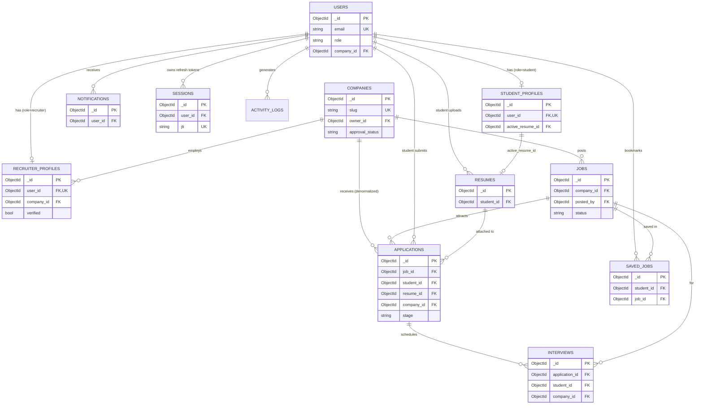

# Placera — Database Relations (ERD)

> MongoDB is non-relational, but Placera models clear logical relationships via referenced ObjectIds (and selective denormalization for read performance). This document is the canonical relationship map.

## Entity Relationship Diagram

## Relationship Cardinality Summary

| From | To | Type | Reference |
|------|----|------|-----------|
| users → student_profiles | 1 : 0..1 | embedded id | `student_profiles.user_id` |
| users → recruiter_profiles | 1 : 0..1 | reference | `recruiter_profiles.user_id` |
| companies → jobs | 1 : N | reference | `jobs.company_id` |
| companies → recruiter_profiles | 1 : N | reference | `recruiter_profiles.company_id` |
| jobs → applications | 1 : N | reference | `applications.job_id` |
| users(student) → applications | 1 : N | reference | `applications.student_id` |
| applications → interviews | 1 : N | reference | `interviews.application_id` |
| users(student) → resumes | 1 : N | reference | `resumes.student_id` |
| users × jobs → saved_jobs | M : N | junction | unique `{student_id, job_id}` |
| users → notifications | 1 : N | reference | `notifications.user_id` |

## Denormalization Decisions (read-optimization)

| Field | Stored on | Why |
|-------|-----------|-----|
| `company_id` | applications, interviews | Recruiter "all applicants for my company" in one index, no join |
| `company logo/name` snapshot | (optional cache on application list responses) | Avoid N+1 lookups in pipeline UI |
| `stats.applicants` | jobs | O(1) counters on dashboards instead of `count()` |
| `match_score`, `ats_score` | applications | Precomputed at apply time for instant ranking/sort |

## Integrity Guarantees

1. **One application per job per student** — enforced by unique compound index.
2. **One active resume per student** — `student_profiles.active_resume_id` is authoritative; `resumes.is_active` mirrors it.
3. **Recruiters bound to a company** — `users.company_id` + `recruiter_profiles.company_id` must match; enforced in the service layer.
4. **Cascade behavior** — handled in services (no DB FKs): closing a job → applications become read-only; deleting a company (admin) → soft-cascades jobs to `closed`.
